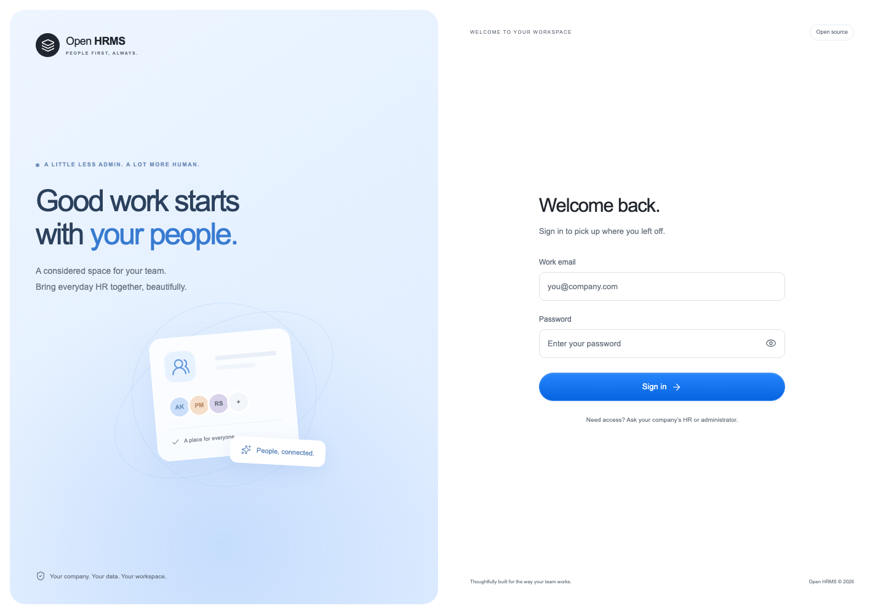
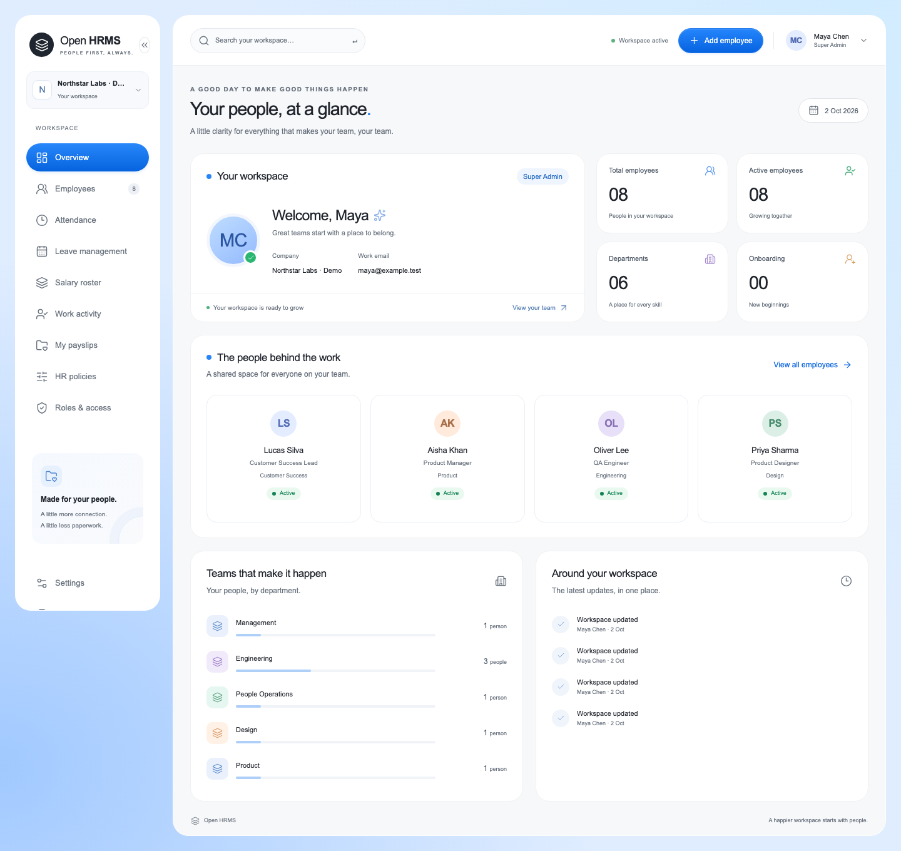
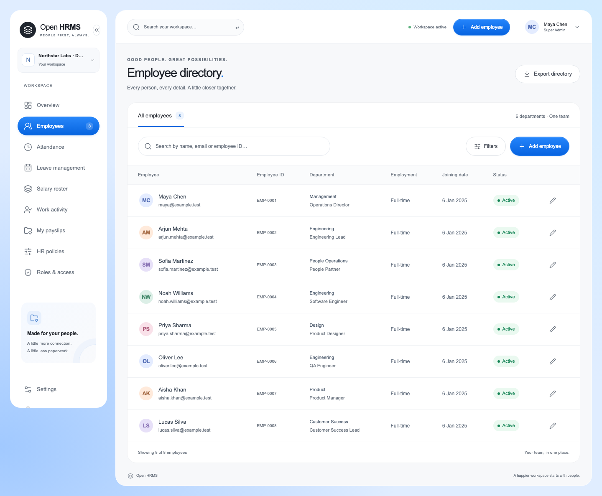
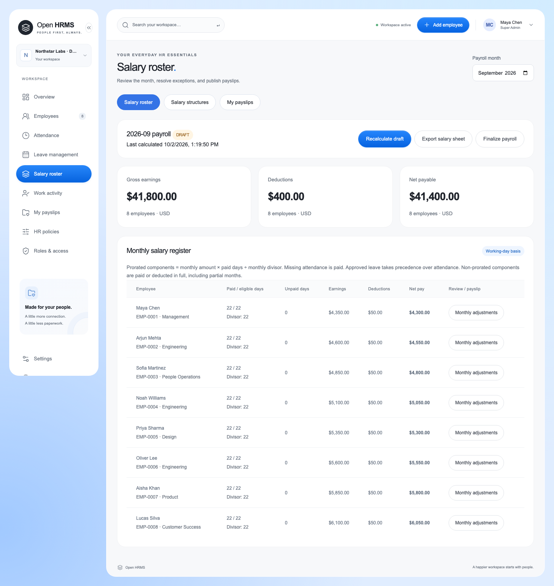
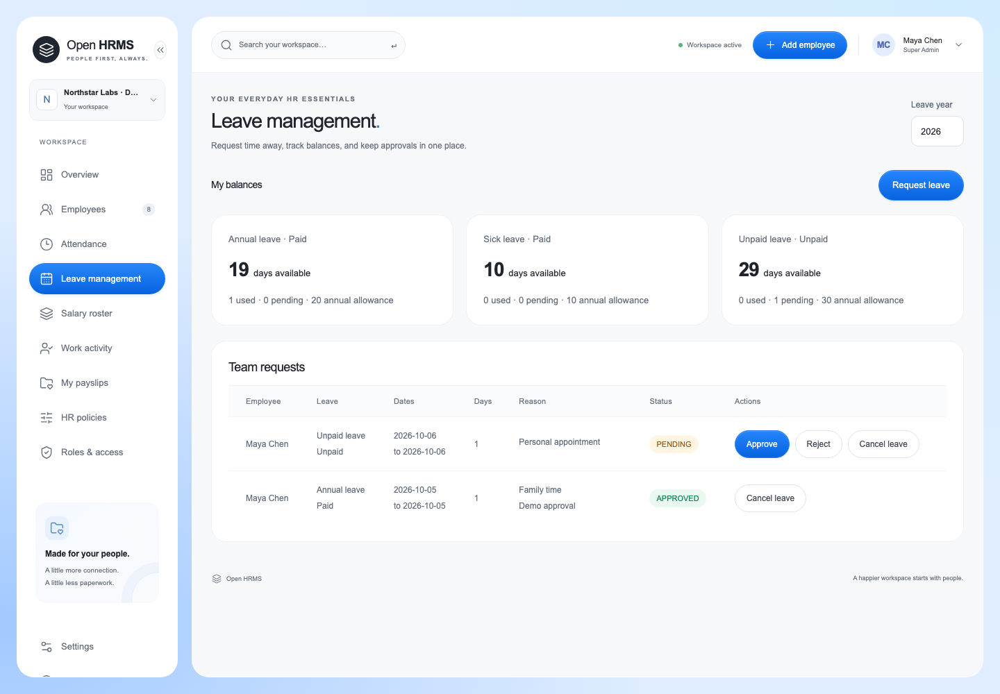

# Open HRMS

**Your people, attendance, leave, and payroll — in one self-hosted workspace.**

[](https://github.com/krunvaghela/open-hrms/actions/workflows/ci.yml)
[](https://github.com/krunvaghela/open-hrms/actions/workflows/security.yml)
[](https://scorecard.dev/viewer/?uri=github.com/krunvaghela/open-hrms)
[](LICENSE)

Open HRMS is an open-source HR management system for teams worldwide. Manage
employees, daily check-in/out, leave approvals, salary rosters, and individual
payslips. An optional, separate desktop app supports visible, employee-controlled
activity tracking and screenshots.

Company details, email provider, currency, timezone, workweek, holidays, leave,
and payroll policies are configured by administrators in the portal. Only
infrastructure settings and encryption secrets live in environment configuration.

[Quick start](#quick-start) · [User guide](docs/USER_GUIDE.md) ·
[Deployment](docs/DEPLOYMENT.md) · [Desktop app](desktop/README.md) ·
[Contributing](CONTRIBUTING.md) · [Security](SECURITY.md)

> **Release status:** pre-1.0, actively developed. Core workflows are implemented
> and tested; independent security review, workload validation, and signed desktop
> distribution remain release gates. Intended for teams of 1–500; that capacity is
> a design target, not a completed load-test result.

## Product tour

Real application screenshots using **fictional employees and illustrative salaries**.
No live company data is included. [Regenerate the screenshots](docs/images/README.md).

### Sign in



### Team overview



### Employee directory



### Monthly salary roster



### Leave management



## What is included

| Area             | Capabilities                                                                                   |
| ---------------- | ---------------------------------------------------------------------------------------------- |
| People           | Employee directory, profiles, departments, reporting managers, CSV export                      |
| Access           | Super Admin, Admin, HR, Employee; server-enforced roles and own-record access                  |
| Attendance       | Daily check-in/out, reviewed corrections, company-local dates                                  |
| Leave            | Paid/unpaid policies, annual allowances, holiday-aware requests and approvals                  |
| Payroll          | Effective-dated salaries, earnings/deductions, adjustments, proration, review and finalization |
| Payslips         | Immutable published snapshots, salary-register CSV, HTML download and browser Print / Save PDF |
| Desktop tracking | Device pairing, explicit Start/Pause, optional selected-display screenshots and retention      |
| Administration   | Company, SMTP provider, currency, timezone, calendar and HR policies in the portal             |
| Operations       | Docker Compose, PostgreSQL persistence, health checks, transactional migrations and CI         |

Salary calculation uses configured components and attendance/leave policies.
**Automatic country-specific taxes, statutory filings, and bank payments are not
implemented.** One installation has one company, currency, and work calendar.
Review the [calculation rules and limitations](docs/USER_GUIDE.md#attendance--leave--payroll).

Desktop active share estimates recent computer interaction. It is not a measure
of work quality and never feeds salary calculations. Tracking is off by default;
employees explicitly start it after checking in. See [tracking behavior and
platform readiness](desktop/README.md).

## Quick start

Requirements: **Docker with Compose v2** and **Node.js 24** for the setup command.

```sh
git clone https://github.com/krunvaghela/open-hrms.git
cd open-hrms
npm run setup
docker compose up --build -d --wait
npm run test:smoke
```

Open **http://127.0.0.1:3000** and create your company and first Super Admin.
There is no default password or seeded employee data. Docker installs locked
dependencies; a local `npm install` is not required to run this stack.

The setup utility generates unique database passwords and an encryption key in
an ignored, permission-restricted `.env`. PostgreSQL is internal by default;
web/API host ports bind only to loopback. Database data lives in a named volume.
**Do not run `docker compose down -v` unless you intend to delete that database.**

For public hosting, complete private first-time setup, configure HTTPS and the
matching `APP_ORIGIN`, and test backup restoration. Follow the
[deployment guide](docs/DEPLOYMENT.md) before using real employee data.

## Security and project health

The badges above report real workflow results and the published OpenSSF Scorecard
score. They may show pending/unavailable until their first analysis completes.
**A security score measures repository practices; it is not a product security
certification.** Read individual findings and the [security policy](SECURITY.md).

- CI checks formatting, TypeScript, payroll and desktop-onboarding logic, Docker
  builds, browser workflows, and API authorization boundaries.
- CodeQL analyzes JavaScript/TypeScript; dependency audits include the Electron
  runtime and build tools. Dependency review checks proposed dependency changes.
- Dependabot proposes updates for packages, Docker images, and pinned GitHub Actions.
- OpenSSF Scorecard publishes supply-chain findings on main-branch updates and weekly.
- GitHub private vulnerability reporting provides a non-public disclosure channel.

[Report a vulnerability privately](https://github.com/krunvaghela/open-hrms/security/advisories/new).
Use [public issues](https://github.com/krunvaghela/open-hrms/issues) for reproducible
bugs and feature requests with fictional data.

## Development

```sh
npm ci
npm run typecheck
npm run test:payroll
npm run test:desktop
npm run format:check
docker compose build
npx playwright install chromium
npm run test:e2e
```

Browser tests create and remove a separate Docker project and database. They do
not seed your main installation. Start the desktop app with
`npm --prefix desktop ci` followed by `npm run desktop:start`.

| Directory          | Purpose                                                               |
| ------------------ | --------------------------------------------------------------------- |
| `apps/web`         | Next.js, React, Tailwind, Radix UI portal                             |
| `apps/api`         | NestJS API, authorization, PostgreSQL migrations and payroll          |
| `desktop`          | Electron tracking app, onboarding and platform packaging              |
| `tests`, `scripts` | Browser, domain, onboarding and infrastructure checks                 |
| `docs`             | Product screenshots, user guide and deployment instructions           |
| `.github`          | CI, security workflows, dependency updates and contribution templates |

## Contributing and support

Read [CONTRIBUTING.md](CONTRIBUTING.md) for setup, checks, and contribution guidance.
Please follow the [code of conduct](CODE_OF_CONDUCT.md). Project maintenance is led
by [@krunvaghela](https://github.com/krunvaghela); community support is through issues,
with no guaranteed response-time or production-support SLA.

The next release gates include MFA/SSO and recovery planning, independent security
and load testing, and signed desktop installers verified on Windows, macOS, and
Linux. See the [deployment readiness checklist](docs/DEPLOYMENT.md#remaining-release-gates).

## License

[Apache License 2.0](LICENSE). No proprietary UI kit assets are included.
